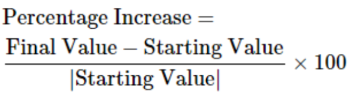
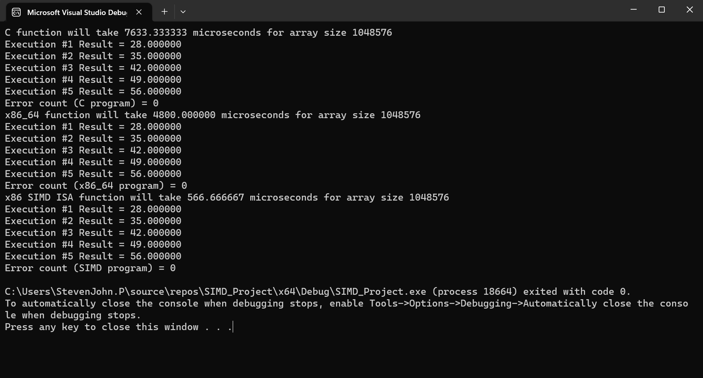
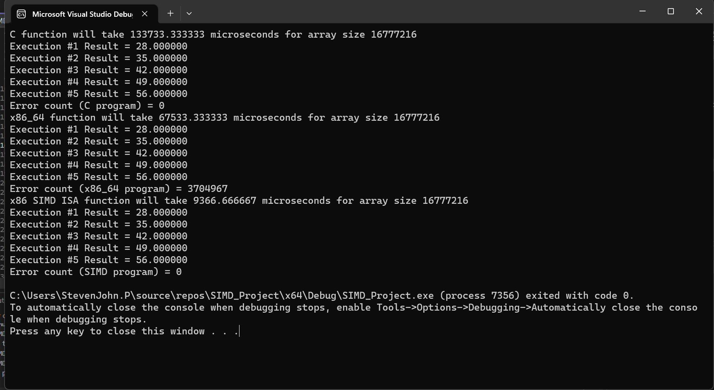
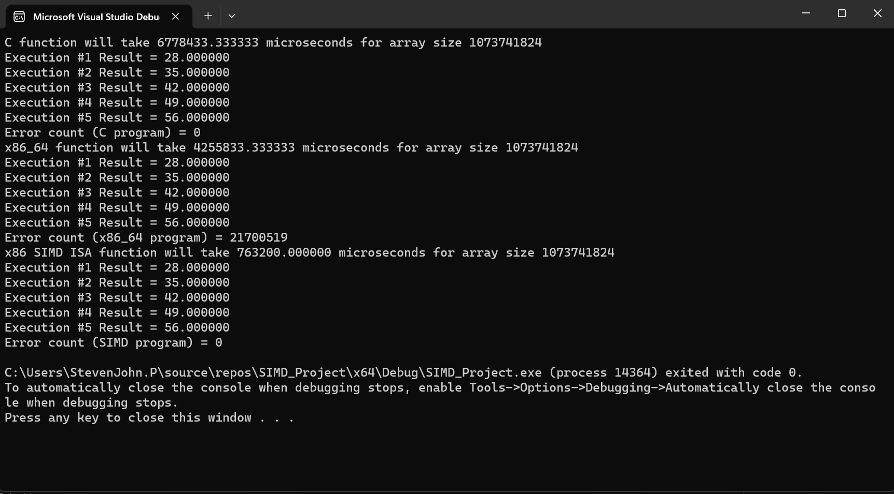
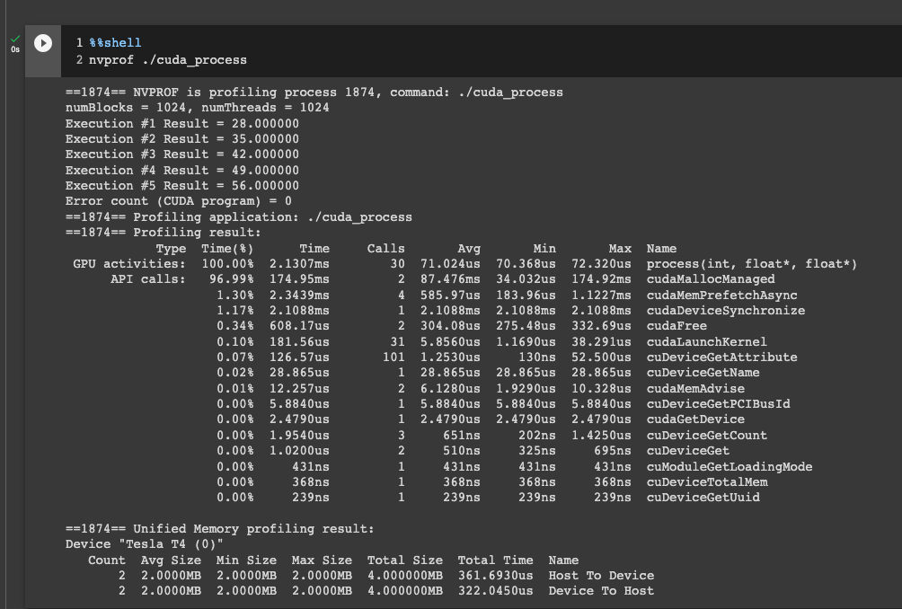
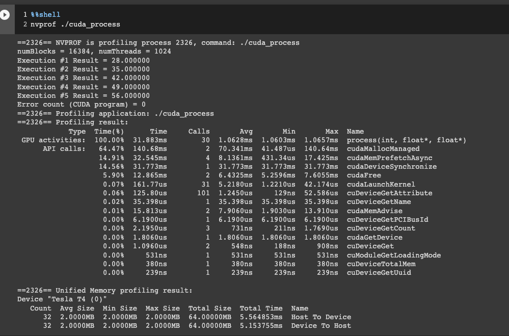
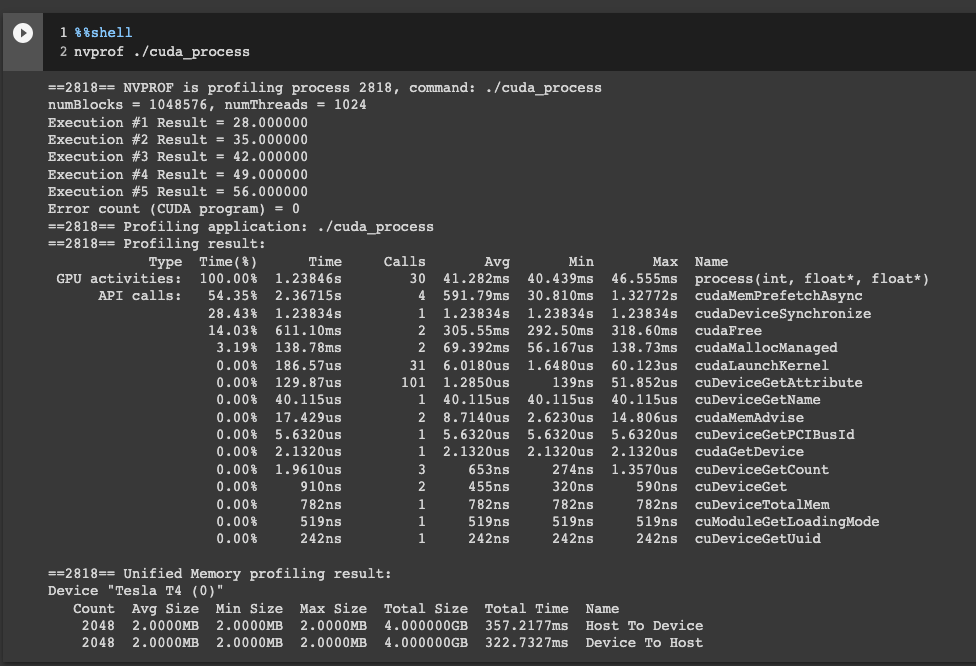

# simd-programming-project

The Number of Runs: 30 and the basis for error checking is the C version.

# C Program
- 2^20 Execution Time: 7,633.33 microseconds (ms)
- 2^24 Execution Time: 133,733.33 microseconds (ms)
- 2^30 Execution Time: 6,778,433.33 microseconds (ms)

# x86-64 non SIMD Program
- 2^20 Execution Time: 4,800.00 microseconds (ms)
- 2^24 Execution Time: 67,533.33 microseconds (ms)
- 2^30 Execution Time: 4,255,833.33 microseconds (ms)

# x86-64 SIMD Program
- 2^20 Execution Time: 566.66 microseconds (ms)
- 2^24 Execution Time: 9,366.66 microseconds (ms)
- 2^30 Execution Time: 763,200.00 microseconds (ms)

# CUDA Program
- 2^20 Execution Time: 0.071024 microseconds (ms)
- Data Transfer Host to Device: 0.361693 microseconds (ms)
- Data Transfer Device to Host: 0.322045 microseconds (ms)
- Total Execution Time with Page Overhead: 0.754762 microseconds (ms)
- =====NEXT=====
- 2^24 Execution Time: 1.0628 microseconds (ms)
- Data Transfer Host to Device: 5.564853 microseconds (ms)
- Data Transfer Device to Host: 5.153755 microseconds (ms)
- Total Execution Time with Page Overhead: 11.781408 microseconds (ms)
- =====NEXT=====
- 2^30 Execution Time: 41.282 microseconds (ms)
- Data Transfer Host to Device: 357.2177 microseconds (ms)
- Data Transfer Device to Host: 322.7327 microseconds (ms)
- Total Execution Time with Page Overhead: 721.2324 microseconds (ms)

# Analysis of Results

For the analysis of the performance of each version, I've used the formula below to compare each programs performance.
<picture>
  
</picture>

At the initial look of the execution time, the CUDA version performed the best in majority of the input size except for the input size is 2^24, where the SIMD version performed better than the CUDA version. Although both SIMD and CUDA is faster than C and non SIMD x86-64 because SIMD and CUDA both utilize parallel processing. Where CUDA can process up to 1024 at a time while SIMD can process 32 bits at a time or 8 floating points.

Now for the analysis of the results using the formula given above. Below are the results and analysis. 
### Comparison of performance with input size of 2^20
## C (Final Value) vs non SIMD x86-64 (Starting Value)
- The non SIMD x86-64 version performed 59.03% better than the C version in terms of execution time.
## C (Final Value) vs SIMD x86-64 (Starting Value)
- The SIMD x86-64 version performed 1,247.07% better than the C version in terms of execution time and can see a significant jump in comparison with the improvement from the non SIMD x86-64 version. This is due to the parallel capability of SIMD compared to the C version where it's not utilizing parallel processing.
## C (Final Value) vs CUDA (Starting Value)
- The CUDA version performed 1,011,255.98% better than the C version in terms of execution time and can see a significant jump in comparison with the improvement from both the non SIMD x86-64 and SIMD x86-64 version. Which is amazing as it's an improvement by a million % in comparison to the non SIMD version with only a 59.03% improvement. This shows how much an impact the parallel processing through threads in CUDA in comparison to sequential processes.
## non SIMD x86-64 (Final Value) vs C (Starting Value)
- The non SIMD x86-64 performed 37.12% better than the C version which could be affected by other factors like the implementation of C vs non SIMD x86-64.
## non SIMD x86-64 (Final Value) vs SIMD x86-64 (Starting Value)
- The non SIMD x86-64 performed 747.07% less than the SIMD x86-64 version and which could be attribute to the parallel processing capability of the SIMD in contrast with the non SIMD x86-64.
## non SIMD x86-64 (Final Value) vs CUDA (Starting Value)
- The non SIMD x86-64 performed 635,862.06% less than the CUDA version which is a huge jump compared to the other version and it is also due to the higher parallel capability of CUDA and optimized implementation.
## SIMD x86-64 (Final Value) vs C (Starting Value)
- 
## SIMD x86-64 (Final Value) vs non SIMD x86-64 (Starting Value)
- 
## SIMD x86-64 (Final Value) vs CUDA (Starting Value)
- The SIMD x86-64 performed 74,977.97% less than the CUDA version but this is also due to the number of threads and blocks the CUDA has and is built for parallel processing.
## CUDA (Final Value) vs C (Starting Value)
- 
## CUDA (Final Value) vs non SIMD x86-64 (Starting Value)
- 
## CUDA (Final Value) vs SIMD x86-64 (Starting Value)
- 

# Conclusion
- 

# Screenshots:

## C, x86-64 non SIMD and SIMD Result of Array Size 2 raise to 20
<picture>
  
</picture>

## C, x86-64 non SIMD and SIMD Result of Array Size 2 raise to 24
<picture>
  
</picture>

## C, x86-64 non SIMD and SIMD Result of Array Size 2 raise to 30
<picture>
  
</picture>

## CUDA Result of Array Size 2 raise to 20
<picture>
  
</picture>

## CUDA Result of Array Size 2 raise to 24
<picture>
  
</picture>

## CUDA Result of Array Size 2 raise to 30
<picture>
  
</picture>
